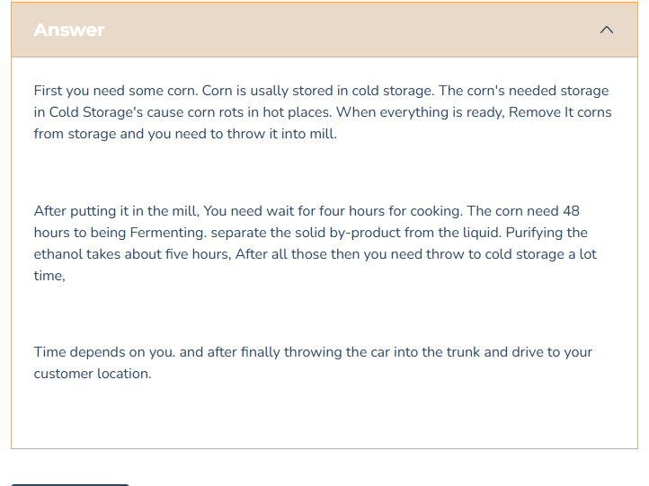

# How to make Corn

First you need some corn. Corn is usally stored in cold storage. The corn's needed storage in Cold Storage's cause corn rots in hot places. When everything is ready, Remove It corns from storage and you need to throw it into mill.
After putting it in the mill, You need wait for four hours for cooking. The corn need 48 hours to being Fermenting. separate the solid by-product from the liquid. Purifying the ethanol takes about five hours,  After all those then you need throw to cold storage a lot time, 
Time depends on you. and after finally throwing the car into the trunk and drive to your customer location.